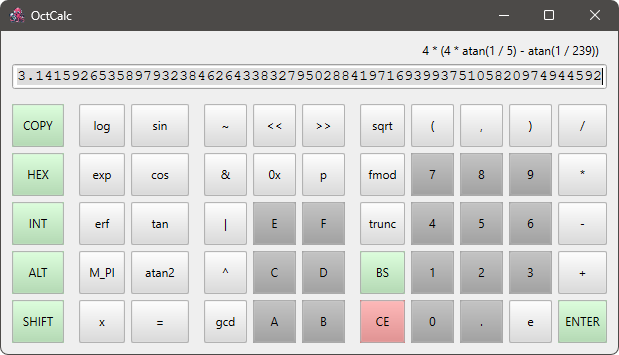

## OctCalc - A portable octuple-precision calculator

Original distribution site : https://github.com/shibatch/octcalc

### Introduction

This is a portable calculator application that runs on Windows, Linux,
and Mac.  It can perform calculations and output results in 256-bit
floating point numbers.  It can also evaluate C-like mathematical
expressions.

### Building on Linux and Mac

1. Check out the source code from our GitHub repository :
`git clone --recurse-submodules https://github.com/shibatch/octcalc`

2. Make a separate directory to create an out-of-source build :
`cd octcalc && mkdir build && cd build`

3. Run cmake to configure the project :
`cmake .. -DCMAKE_INSTALL_PREFIX=../../install`

4. Run make to build and install the project :
`make && make install`

### Building on Windows

1. Download and install Visual Studio Community 20XX.
  * Choose "Desktop development with C++" option in Workloads pane.
  * Choose "C++ CMake tools for Windows" in Individual components
    pane.
  * Optionally, choose "C++ Clang Compiler for Windows" in Individual
    components pane.

2. Download and install WiX Toolset v3.
  * https://wixtoolset.org/

3. Download and install Windows-MSVC version of Qt6.
  * https://sourceforge.net/projects/fsu0413-qtbuilds/
  * Extract the archive so that c:\opt\qt6\bin\designer.exe is seen.

4. Create a build directory, launch Developer Command Prompt for VS
  20XX and move to the build directory.

5. Check out the source code from our GitHub repository :
`git clone --recurse-submodules https://github.com/shibatch/octcalc`

6. Run the batch file for building with MSVC.
`cd octcalc && winbuild-msvc.bat -DENABLE_WIX=True`

### License

The software is distributed under the Boost Software License, Version 1.0.
See accompanying file LICENSE.txt or copy at :
http://www.boost.org/LICENSE_1_0.txt.

Contributions to this project are accepted under the same license.

The fact that this software is released under an open source license
only means that you can use the current version of the software for
free. If you want this software to be maintained, you need to
financially support the project.

Copyright Naoki Shibata 2024.
